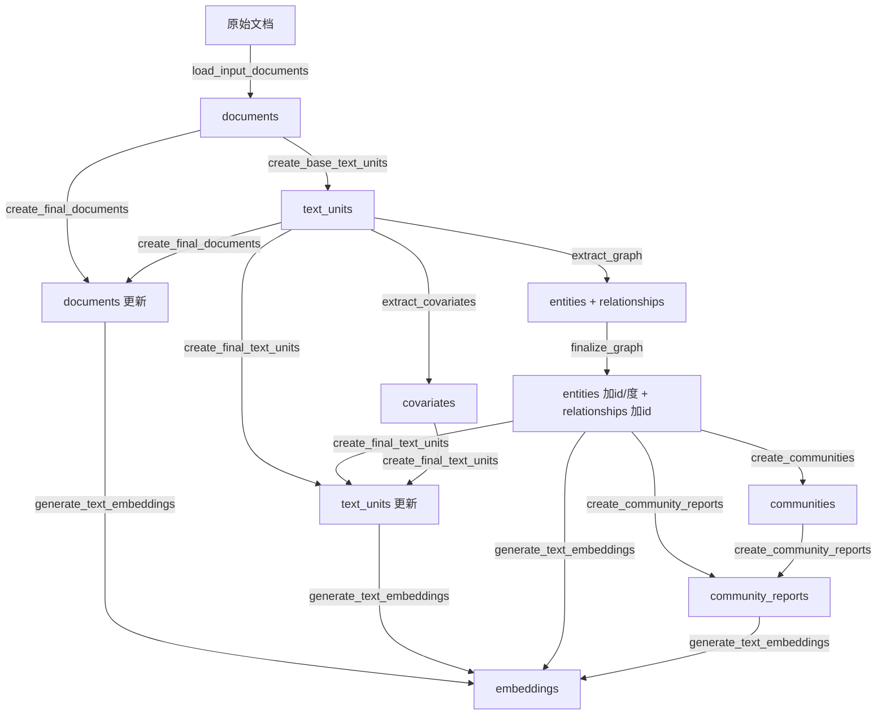

# GraphRAG Workflows 执行顺序指南

GraphRAG 通过 `PipelineFactory`（定义在 `factory.py`）编排 workflows 的执行顺序。  
共有 **4 种 Pipeline 模式**，每种模式按顺序执行不同的 workflow。

---

## 一、Standard 模式（标准索引）

> 使用 LLM 进行图构建 + 摘要，质量最高但速度最慢。

```
IndexingMethod.Standard:  load_input_documents → [9 个标准 workflow]
```

| 序号 | Workflow | 输入 | 输出 | 作用 |
|------|----------|------|------|------|
| 0 | `load_input_documents` | 原始文件 (CSV/JSON/TXT) | `documents` 表 | 加载并解析原始文档 |
| 1 | `create_base_text_units` | `documents` | `text_units` 表 | 将文档分块（chunk） |
| 2 | `create_final_documents` | `documents` + `text_units` | `documents` 表（更新） | 给文档关联其包含的 text_unit_ids |
| 3 | `extract_graph` | `text_units` | `entities` + `relationships` 表 | **LLM 提取实体和关系 + 摘要合并** |
| 4 | `finalize_graph` | `entities` + `relationships` | `entities`（+id/度/坐标） + `relationships`（+id） | 添加 UUID、计算度、布局坐标 |
| 5 | `extract_covariates` | `text_units` | `covariates` 表 | LLM 提取协变量（声明/属性） |
| 6 | `create_communities` | `entities` + `relationships` | `communities` 表 | **Leiden 算法层次聚类** |
| 7 | `create_final_text_units` | `text_units` + `entities` + `relationships` + `covariates` | `text_units` 表（更新） | 关联 entity_ids、relationship_ids |
| 8 | `create_community_reports` | `entities` + `communities` + `relationships` | `community_reports` 表 | **LLM 为每个社区生成摘要报告** |
| 9 | `generate_text_embeddings` | 各种表 | 各种 embedding 表 | 生成向量嵌入（用于搜索） |

### 数据流图



---

## 二、Fast 模式（快速索引）

> 使用 NLP（名词短语提取）替代 LLM 构图，速度更快但质量稍低。

```
IndexingMethod.Fast:  load_input_documents → [9 个快速 workflow]
```

| 序号 | Workflow | 与 Standard 的区别 |
|------|----------|-------------------|
| 0 | `load_input_documents` | 相同 |
| 1 | `create_base_text_units` | 相同 |
| 2 | `create_final_documents` | 相同 |
| 3 | **`extract_graph_nlp`** | ⚡ 用 NLP 名词短语提取代替 LLM |
| 4 | **`prune_graph`** | ⚡ 新增：修剪低频/低权重节点和边 |
| 5 | `finalize_graph` | 相同 |
| 6 | `create_communities` | 相同 |
| 7 | `create_final_text_units` | 相同 |
| 8 | **`create_community_reports_text`** | ⚡ 基于文本块上下文而非实体关系生成报告 |
| 9 | `generate_text_embeddings` | 相同 |

### 与 Standard 的关键差异

| 步骤 | Standard | Fast |
|------|----------|------|
| 图构建 | `extract_graph`（LLM 提取） | `extract_graph_nlp`（NLP 名词短语） |
| 图修剪 | 无 | `prune_graph`（去除噪声节点） |
| 社区报告 | `create_community_reports`（基于实体关系） | `create_community_reports_text`（基于原文文本块） |

---

## 三、StandardUpdate 模式（标准增量更新）

> 在已有索引基础上，只处理新增文档。

```
IndexingMethod.StandardUpdate:
  load_update_documents → [9 标准 workflow] → [8 更新 workflow]
```

**第一阶段：对新文档执行完整标准流程**

| 序号 | Workflow | 说明 |
|------|----------|------|
| 0 | `load_update_documents` | 加载新增文档（与旧文档做差集） |
| 1-9 | _standard_workflows | 对新文档执行完整的标准索引 |

**第二阶段：将新结果合并到已有索引中**

| 序号 | Workflow | 作用 |
|------|----------|------|
| 10 | `update_final_documents` | 合并新旧文档表 |
| 11 | `update_entities_relationships` | 合并新旧实体和关系，处理重复 |
| 12 | `update_text_units` | 合并新旧文本块 |
| 13 | `update_covariates` | 合并新旧协变量 |
| 14 | `update_communities` | 重新聚类（合并后的完整图） |
| 15 | `update_community_reports` | 重新生成社区报告 |
| 16 | `update_text_embeddings` | 更新向量嵌入 |
| 17 | `update_clean_state` | 清理临时状态 |

---

## 四、FastUpdate 模式（快速增量更新）

> 快速索引 + 增量更新的组合。

```
IndexingMethod.FastUpdate:
  load_update_documents → [9 快速 workflow] → [8 更新 workflow]
```

与 StandardUpdate 结构相同，只是第一阶段使用 Fast 模式的 workflow。

---

## 各 Workflow 文件功能速查

### 标准 Workflows

| 文件 | 核心功能 | 是否用 LLM |
|------|---------|-----------|
| `load_input_documents.py` | 加载原始文档 | ❌ |
| `create_base_text_units.py` | 文档分块 | ❌ |
| `create_final_documents.py` | 文档关联 text_unit_ids | ❌ |
| `extract_graph.py` | 实体/关系提取 + 描述摘要 | ✅ |
| `finalize_graph.py` | 添加 UUID、度、布局坐标 | ❌ |
| `extract_covariates.py` | 协变量提取 | ✅ |
| `create_communities.py` | Leiden 层次聚类 | ❌ |
| `create_final_text_units.py` | 文本块关联实体/关系 | ❌ |
| `create_community_reports.py` | 社区摘要报告生成 | ✅ |
| `generate_text_embeddings.py` | 向量嵌入生成 | ✅（Embedding 模型） |

### Fast 专用 Workflows

| 文件 | 核心功能 | 替代的标准 Workflow |
|------|---------|-------------------|
| `extract_graph_nlp.py` | NLP 名词短语构图 | `extract_graph.py` |
| `prune_graph.py` | 修剪低质量节点和边 | 无（新增步骤） |
| `create_community_reports_text.py` | 基于文本块的社区报告 | `create_community_reports.py` |

### 增量更新 Workflows

| 文件 | 核心功能 |
|------|---------|
| `load_update_documents.py` | 加载新增文档 |
| `update_final_documents.py` | 合并新旧文档 |
| `update_entities_relationships.py` | 合并新旧实体/关系 |
| `update_text_units.py` | 合并新旧文本块 |
| `update_covariates.py` | 合并新旧协变量 |
| `update_communities.py` | 重新社区聚类 |
| `update_community_reports.py` | 重新生成报告 |
| `update_text_embeddings.py` | 更新嵌入 |
| `update_clean_state.py` | 清理临时状态 |

---

## Pipeline 选择方式

在配置中通过 `IndexingMethod` 枚举选择：

```yaml
# settings.yaml
method: standard    # standard | fast | standard-update | fast-update
```

也可以通过 `config.workflows` 自定义 workflow 列表，覆盖默认流程。

> **源码定义位置**: `factory.py` 第 52-97 行。
